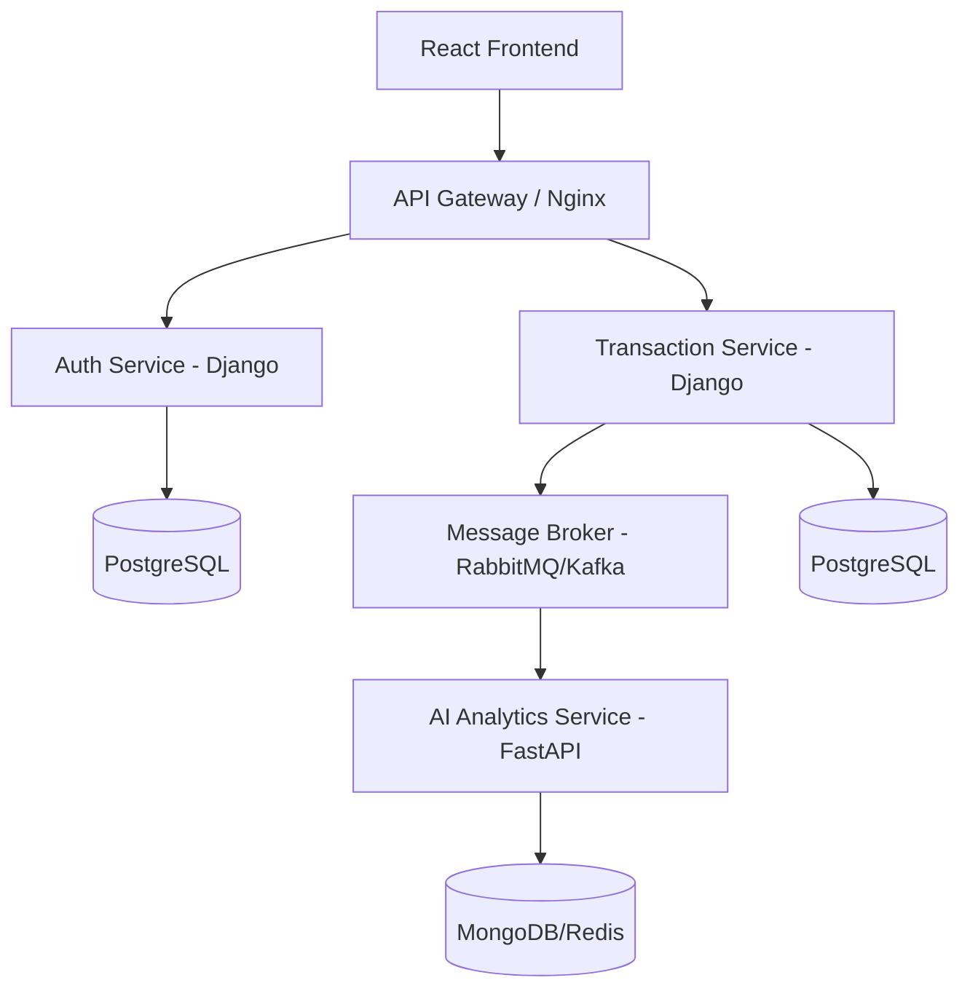

# AI-Powered Personal Finance Dashboard: Engineering Roadmap

This document outlines the architectural vision and implementation steps for building a production-grade personal finance dashboard. We follow a "Monolith-First" approach, ensuring core business logic is solid before decomposing into a distributed microservices system.

## 🏗️ System Architecture

### The Target (Microservices)

---

## 🛠️ Phase 1: The Modular Monolith (Foundation)
*Objective: Build a working end-to-end application within a single repository to master Django, React, and basic CRUD.*

### 1. Backend: Django Core
- **Environment:** Setup Python virtualenv and install `django`, `djangorestframework`, `django-cors-headers`, `psycopg2-binary`, `python-dotenv`.
- **Database:** Initialize PostgreSQL (local or Docker).
- **Models:**
    - `User`: Extend Django's AbstractUser.
    - `Bucket` (NEW): Hierarchical structure (`parent` self-reference). Master types: **Needs**, **Wants**, **Goals**. 
        - *Example: Needs -> Utilities -> Electricity.*
    - `Transaction`: `amount`, `date`, `description`, `raw_text`, `bucket` (ForeignKey), `is_recurring` (Boolean).
    - `RecurringTransaction`: Logic to track subscription/fixed costs (mortgage, utilities) and auto-prompt entries since last login.
- **APIs:** Create RESTful endpoints for Transactions and Buckets.

...

---

## 💎 Phase 5: Wealth Management & Financial Wisdom
*Objective: Transition from "Expense Tracking" to "Net Worth & Growth."*

### 1. Balance Tracking (Assets & Liabilities)
- **Models:**
    - `Account`: `name`, `type` (Cash, Investment, Debt, Property), `current_balance`.
- **Net Worth Engine:** Real-time calculation of `Total Assets - Total Liabilities`.

### 2. The "Wisdom" Engine
- **Financial Benchmarks:** Compare user spending against the **50/30/20 Rule**.
- **Insights:** Provide proactive tips when specific buckets (like "Housing") exceed recommended percentages of income.
- **Visuals:** Hierarchical "Sunburst" charts to visualize nested buckets.

### 2. Frontend: React Visuals
- **Tooling:** Initialize with `Vite` (React + TypeScript).
- **State Management:** Start with `React Context` or `Zustand` for simple global state.
- **UI Kit:** Use `Tailwind CSS` for styling and `Lucide-React` for icons.
- **Charts:** Implement `Recharts` for spending breakdowns.
- **Auth:** Implement JWT-based authentication flow (Login/Signup).

---

## 🧠 Phase 2: The "Python Magic" (AI Integration)
*Objective: Transform raw data into insights using NLP.*

### 1. AI Categorizer Logic
- Develop a Python module that takes a string (e.g., "Starbucks Seattle") and returns a category ("Food & Drink").
- **Approaches:**
    - **Simple:** Regex/Keyword mapping.
    - **Advanced:** Use `OpenAI API` (gpt-3.5-turbo) or `spaCy` for local NLP.
- **Asynchronous Execution:** Integrate `Celery` with `Redis` to run AI categorization in the background when a transaction is created, preventing UI lag.

### 2. RAG-Powered Financial Assistant
*Objective: Let users ask natural-language questions about their own finances ("How much did I spend on dining out last quarter?", "Am I over budget on Housing?") and get answers grounded in their actual transaction/bucket data instead of a generic LLM response.*

- **Embedding Pipeline:**
    - On transaction create/update, generate a text summary (merchant, amount, date, bucket, recurring flag) and compute an embedding via `OpenAI text-embedding-3-small` (or a local `sentence-transformers` model to avoid API cost/latency).
    - Store the embedding alongside the source row using the `pgvector` extension on the existing PostgreSQL `CoreDB` — avoids standing up a separate vector database for v1.
- **Retrieval:**
    - Embed the user's question at query time.
    - Run a similarity search (`pgvector` cosine distance) scoped to that user's rows to fetch the top-k most relevant transactions/bucket summaries.
    - Include a lightweight aggregation pass (e.g., sum by bucket/date range) so the model isn't just reasoning over raw rows for numeric questions.
- **Generation:**
    - Inject the retrieved rows/aggregates into the LLM prompt as grounding context, along with the user's question.
    - Call the LLM (OpenAI API, swappable later) to produce a natural-language answer citing the retrieved data.
    - Return the answer plus the underlying transactions used, so the UI can show "sources" for trust/verification.
- **Service Placement:** Implement as an endpoint on the existing `AI Analytics Service` (FastAPI, Phase 3) rather than a new service — keeps the RAG logic co-located with the other AI/categorization work and reuses its async infrastructure.
- **Stretch:** Once deployed to GCP (Phase 4), evaluate swapping self-hosted `pgvector` for a managed option (e.g., Vertex AI Vector Search) if query volume/latency justifies it.

---

## 🚀 Phase 3: Transition to Microservices
*Objective: Decouple services to achieve independent scalability and polyglot persistence.*

### 1. Decomposition Steps
1.  **Auth Service:** Extract the User model and Auth logic into a standalone Django service.
2.  **Transaction Core:** The main app focus shifts purely to transaction management.
3.  **AI Analytics Service:** Rewrite the AI logic as a `FastAPI` service. It should be lightweight and optimized for high-throughput categorization.

### 2. Event-Driven Communication
- Replace direct function calls with an **Event Bus**.
- When `Transaction Service` saves a record, it emits a `TRANSACTION_CREATED` event to **RabbitMQ**.
- `AI Analytics Service` listens for this event, processes the text, and updates its own analytics database (MongoDB).

---

## 🐳 Phase 4: Containerization, DevOps & GCP Cloud Hosting
*Objective: Ensure scalability, configure infrastructure as code, and establish continuous integration/continuous deployment (CI/CD) to Google Cloud Platform (GCP).*

### 1. Dockerization
- Write `Dockerfiles` for each service (Django, FastAPI, React).
- Create a `docker-compose.yml` to orchestrate:
    - PostgreSQL (AuthDB)
    - PostgreSQL (CoreDB)
    - MongoDB (Analytics)
    - RabbitMQ (Broker)
    - Redis (Cache/Celery)
    - Nginx (API Gateway)

### 2. Infrastructure as Code (Terraform)
- **State Setup:** Use a GCP Google Cloud Storage (GCS) bucket for storing Terraform state files securely.
- **Resource Definition:** Define Terraform config files (`main.tf`, `variables.tf`, `outputs.tf`) to provision:
    - A custom VPC network and firewall rules (allowing HTTP/HTTPS).
    - A managed PostgreSQL instance (Google Cloud SQL) or VM-hosted database.
    - A Google Compute Engine (GCE) VM instance to host the services, or a Google Kubernetes Engine (GKE) cluster for scaling.
    - Google Artifact Registry (GAR) to store Docker images.

### 3. Engineering Standards & CI/CD (GitHub Actions)
- **Testing & Linting:** 
    - Django: `Pytest` for unit/integration tests; `Ruff` for linting.
    - React: `Vitest` and `React Testing Library`; `ESLint/Prettier` for linting.
- **Continuous Integration (CI):** Implement GitHub Actions workflow to run tests on every push.
- **Continuous Delivery (CD):** Extend GitHub Actions workflow on merge to `main` to:
    - Authenticate with GCP using service account credentials.
    - Build and push React, Django, and FastAPI Docker images to Google Artifact Registry.
    - SSH/trigger deployment to the target GCE VM (or deploy manifests to GKE) for a zero-downtime release.

---

## 📈 Success Milestones
1.  [ ] **Milestone 1:** React app displays hardcoded transactions from Django API.
2.  [ ] **Milestone 2:** User uploads a CSV; AI categorizes 80%+ correctly.
2b. [ ] **Milestone 2b:** User can ask a natural-language question and get an answer grounded in retrieved transaction data via the RAG pipeline (pgvector + LLM).
3.  [ ] **Milestone 3:** Microservices communicate via RabbitMQ successfully.
4.  [ ] **Milestone 4:** Full system deployable locally via a single `docker-compose up`.
5.  [ ] **Milestone 5:** Terraform script successfully provisions GCP network, VM, and database.
6.  [ ] **Milestone 6:** GitHub Actions automatically builds, tests, and deploys the application to GCP on every push.
