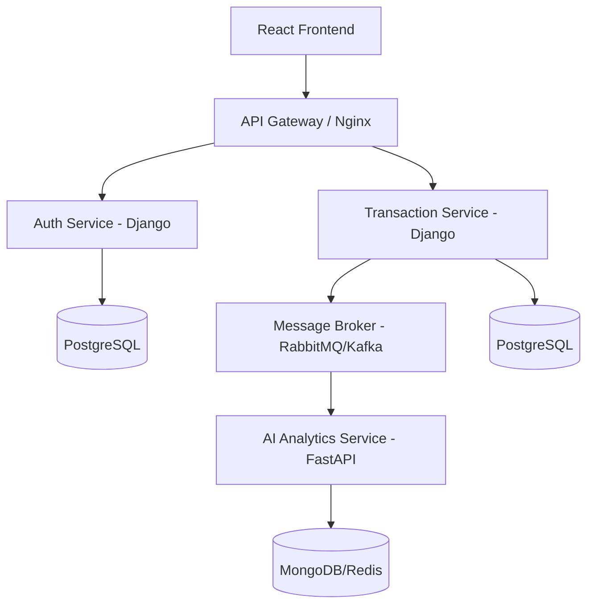

# AI-Powered Personal Finance Dashboard: Engineering Roadmap

This document outlines the architectural vision and implementation steps for building a production-grade personal finance dashboard. We follow a "Monolith-First" approach, ensuring core business logic is solid before decomposing into a distributed microservices system.

## 🏗️ System Architecture

### The Target (Microservices)

---

## 🛠️ Phase 1: The Modular Monolith (Foundation)
*Objective: Build a working end-to-end application within a single repository to master Django, React, and basic CRUD.*

### 1. Backend: Django Core
- **Environment:** Setup Python virtualenv and install `django`, `djangorestframework`, `django-cors-headers`, `psycopg2-binary`.
- **Database:** Initialize PostgreSQL (local or Docker).
- **Models:**
    - `User`: Extend Django's AbstractUser.
    - `Transaction`: `amount`, `date`, `description`, `raw_text`, `category` (ForeignKey).
    - `Category`: `name`, `icon`, `color`.
- **APIs:** Create RESTful endpoints for Transactions and Categories.

### 2. Frontend: React Visuals
- **Tooling:** Initialize with `Vite` (React + TypeScript).
- **State Management:** Start with `React Context` or `Zustand` for simple global state.
- **UI Kit:** Use `Tailwind CSS` for styling and `Lucide-React` for icons.
- **Charts:** Implement `Recharts` for spending breakdowns.
- **Auth:** Implement JWT-based authentication flow (Login/Signup).

---

## 🧠 Phase 2: The "Python Magic" (AI Integration)
*Objective: Transform raw data into insights using NLP.*

### 1. AI Categorizer Logic
- Develop a Python module that takes a string (e.g., "Starbucks Seattle") and returns a category ("Food & Drink").
- **Approaches:**
    - **Simple:** Regex/Keyword mapping.
    - **Advanced:** Use `OpenAI API` (gpt-3.5-turbo) or `spaCy` for local NLP.
- **Asynchronous Execution:** Integrate `Celery` with `Redis` to run AI categorization in the background when a transaction is created, preventing UI lag.

---

## 🚀 Phase 3: Transition to Microservices
*Objective: Decouple services to achieve independent scalability and polyglot persistence.*

### 1. Decomposition Steps
1.  **Auth Service:** Extract the User model and Auth logic into a standalone Django service.
2.  **Transaction Core:** The main app focus shifts purely to transaction management.
3.  **AI Analytics Service:** Rewrite the AI logic as a `FastAPI` service. It should be lightweight and optimized for high-throughput categorization.

### 2. Event-Driven Communication
- Replace direct function calls with an **Event Bus**.
- When `Transaction Service` saves a record, it emits a `TRANSACTION_CREATED` event to **RabbitMQ**.
- `AI Analytics Service` listens for this event, processes the text, and updates its own analytics database (MongoDB).

---

## 🐳 Phase 4: Containerization & DevOps
*Objective: Ensure "It works on my machine" means "It works everywhere."*

### 1. Dockerization
- Write `Dockerfiles` for each service (Django, FastAPI, React).
- Create a `docker-compose.yml` to orchestrate:
    - PostgreSQL (AuthDB)
    - PostgreSQL (CoreDB)
    - MongoDB (Analytics)
    - RabbitMQ (Broker)
    - Redis (Cache/Celery)
    - Nginx (API Gateway)

### 2. Engineering Standards
- **Testing:** 
    - Django: `Pytest` for unit and integration tests.
    - React: `Vitest` and `React Testing Library`.
- **Linting:** Use `Ruff` for Python and `ESLint/Prettier` for React.
- **Documentation:** Maintain OpenAPI/Swagger docs for all services.

---

## 📈 Success Milestones
1.  [ ] **Milestone 1:** React app displays hardcoded transactions from Django API.
2.  [ ] **Milestone 2:** User uploads a CSV; AI categorizes 80%+ correctly.
3.  [ ] **Milestone 3:** Microservices communicate via RabbitMQ successfully.
4.  [ ] **Milestone 4:** Full system deployable via a single `docker-compose up`.
